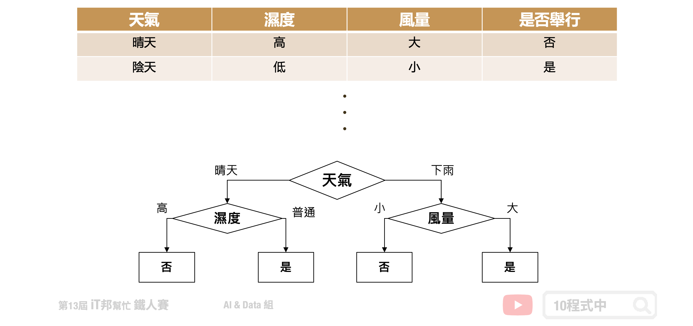
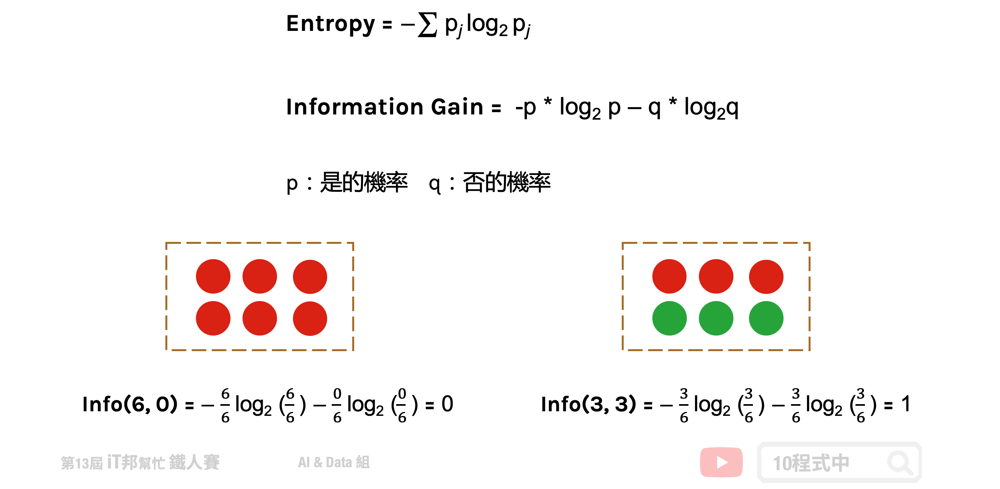

# 決策樹 (Decision tree)
## 今日學習目標
- 決策樹演算法介紹
    - 決策樹如何生成？
    - 如何處理分類問題？
    - 如何處理迴歸問題？
- 實作決策樹分類器
    - 觀察決策樹是如何生成的。
- 實作決策樹迴歸器
    - 查看決策樹方法在簡單線性迴歸和非線性迴歸表現。

##  決策樹
決策樹會根據訓練資料產生一棵樹，依據訓練出來的規則來對新樣本進行預測。決策樹演算法可以使用不同的方式來評估分枝的好壞(亂度)，例如像是 Information gain、Gain ratio、Gini index。依據訓練資料找出合適的規則，最終生成一個規則樹來決策所有事情，其目的使每一個決策能夠使訊息增益最大化。就好比我們評估今天比賽是否舉行，天氣因子可能站比較大的因素，而 Co2 的濃度高低可能站的因子程度較低。因此在第一層的決策中以天氣的特徵先進行第一次的決策判斷。接著第二層再從所有特徵中尋找最適合的決策因子，直到設定的最大樹的深度即停止樹的生長。



## 決策樹如何生成？
決策樹是以一個貪婪法則來決定每一層要問什麼問題，目標是分類過後每一群能夠很明顯的知道是屬於哪一種類別。延續上面的例子，以分類問題來說假設要評估明天比賽是否舉行。在樹的第一層節點中我們要從已知的兩個特徵分別是溫度與特徵選一個作為該層的決策因子。假設目前訓練集有五筆資料，其中正常舉行的有後筆資料，取消舉行的有三筆資料。在樹的結構中左子樹為決策正常取行，而右子樹是決策取消舉行。我們可以發現當特徵為天氣的時候可以一很清楚的將這兩類別完整分開，因此我們會將天氣作為這一層判斷的因子。這就是決策樹在生成中的貪婪機制。然而要如何去判斷每次決策的好壞，就必須依靠亂度的評估指標。


## 決策樹的混亂評估指標
我們需要客觀的標準來決定決策樹的每個分支，因此我們需要有一個評斷的指標來協助我們決策。決策樹演算法可以使用不同的指標來評估分枝的好壞，常見的決策亂度評估指標有 Information gain、Gain ratio、Gini index。我們目標是從訓練資料中找出一套決策規則，讓每一個決策能夠使訊息增益最大化。以上的指標都是在衡量一個序列中的混亂程度，其數值越高代表越混亂。然而在 Sklearn 套件中預設使用 Gini。

- Information gain (資訊獲利) 
- Gain ratio (吉尼獲利)
- Gini index (吉尼係數)  = Gini Impurity (吉尼不純度)

## 評估分割資訊量
Information Gain 透過從訓練資料找出規則，讓每一個決策能夠使訊息增益最大化。其算法主要是計算熵，因此經由決策樹分割後的資訊量要越小越好。而 Gini 的數值越大代表序列中的資料亂，數值皆為 0~1 之間，其中 0 代表該特徵在序列中是完美的分類。常見的資訊量評估方法有兩種：資訊獲利 (Information Gain) 以及 Gini 不純度 (Gini Impurity)。


## 熵 (Entropy)
熵 (Entropy) 是計算 Information Gain 的一種方法。在了解 Information Gain 之前要先了解熵是如何被計算出來的。其中在下圖公式中 p 代表是的機率、q 代表否的機率。我們可以從圖中範例很清楚地知道當所有的資料都被分類一致的時候 Entropy 即為 0，當資料各有一半不同時 Entropy 即為 1。



## Gini 不純度 (Gini Impurity)
Gini 不純度是另一種亂度的衡量方式，它的數字越大代表序列中的資料越混亂。公式如下所示，其中 p 代表是的機率、q 為代表否的機率。我們可以從圖中範例很清楚地知道當所有的資料都被分類一致的時候混亂程度即為 0，當資料各有一半不同時混亂程度即為 0.5。


##  迴歸樹
決策樹迴歸方法與分類有點類似差別僅在於評估分枝好壞的方式不同，我們又可以稱作迴歸樹。當數據集的輸出爲連續性數值時，該樹算法就是一個迴歸樹。透過樹的展開，並用葉節點的均值作爲預測值。從根節點開始，對樣本的某一特徵進行測試。經過評估後，將樣本分配到其子結點。此時每一個子節點對應著該特徵的一個值。依照這樣方式進行，直至到達葉結點。此時誤差值要最小化，並且越接近零越好。

> 迴歸樹的生長過程很推薦看[這篇](https://zhuanlan.zhihu.com/p/82054400)文章

以下舉一個例子假設 x 是輸入 y 是輸出，我們可以在一個平面上繪製出資料與正確答案間的分佈。假設迴歸樹的最大深度設定兩層。首先在第一層中會將所有的資料從中間切一刀此斷點為 `x=0.496` 當大於設定的值的數據點會繼續往右子樹下去延伸，反之小於 0.496 的資料點會往左子樹走。此時將會切出一個分支出來並往下擴展並形成第二層的決策分支。一直不斷持續拓展直到設定的最大深度終止，此時的節點即為葉節點也就是最終的模型輸出值。


## 樹越深模型越複雜
假設我們生成一個 `f(x) = 3x+15 + noise` 的資料，其中 noise 為一個 0~1 之間的隨機數。從以下的測試可以看出隨著決策樹深度的增加，決策樹的擬合能力不斷上升。決策樹已經不僅僅擬合了我們的線性函式 `3x+15`，同時也擬合了我們添加的噪音(noise)。


## 迴歸樹該如何選擇切割點?
在分類模型中決策樹是以亂度作為決策樹生成時候的評估指標。但是迴歸樹透過是 `MSE` 或 `MAE` 來評估模型，並找出誤差最小的值作為樹的特徵選擇與切割點。其中前者是均方差，後者是和均值之差的絕對值之和。


## CART 決策樹
在 Sklearn 套件中決策樹演算法是採用 CART (Classification and Regression Tree) 演算法，並且可以被拿來做分類和迴歸的預測。在決策樹的每一個節點上都是採用二分法，也就是每一個決策節點只分枝出兩個子節點。並且不斷地往下拓展，直到設定的最大深度為止，此時最大深度的節點稱為葉節點即為模型的預測輸出。


## 決策樹模型的優缺點
建立決策樹的過程就是不斷的尋找特徵進行決策，透過這些決策盡量的使這些資料被分為同一個類別，且試著讓混亂程度越小越好。切記樹的深度越深不一定越好，他可能會造成過度擬合的問題。訓練好的模型我們能夠視覺化決策樹的結構，相對的可解釋性就變高。此外與其它的ML模型比較起來，決策樹執行速度是它的一大優勢。因為是樹狀結構，因此在進行機器學習的時候每個決策階段都相當的明確清楚，不是 0 就是 1。


## 決策樹總結
決策樹透過所有特徵與對應的值將資料切分，來找出最適合的分枝並繼續往下拓展。若決策樹深度越深則決策的規則將越複雜，模型預測也會越接近真實答案。但若訓練集中含有過多的雜訊，太深的樹就有可能產生過擬合的情形。因此單一的決策樹肯定是不夠用的，我們可以利用集成學習中的 Boosting 架構，對迴歸樹進行改良升級。


## [程式實作]
## 分類決策樹
一個決策樹會根據訓練資料自動產生一棵樹。決策樹會根據資料產生很多樹狀的規則，最終訓練出來的規則會對新樣本進行預測。

Parameters:
- criterion: 亂度的評估標準，gini/entropy。預設為gini。
- max_depth: 樹的最大深度。
- splitter: 特徵劃分點選擇標準，best/random。預設為best。
- random_state: 亂數種子，確保每次訓練結果都一樣，splitter=random 才有用。
- min_samples_split: 至少有多少資料才能再分
- min_samples_leaf: 分完至少有多少資料才能分

Attributes:
- feature_importances_: 查詢模型特徵的重要程度。

Methods:
- fit: 放入X、y進行模型擬合。
- predict: 預測並回傳預測類別。
- score: 預測成功的比例。
- predict_proba: 預測每個類別的機率值。
- get_depth: 取得樹的深度。

```py
from sklearn.tree import DecisionTreeClassifier

# 建立 DecisionTreeClassifier 模型
decisionTreeModel = DecisionTreeClassifier(criterion = 'entropy', max_depth=6, random_state=42)
# 使用訓練資料訓練模型
decisionTreeModel.fit(train_reduced, y_train)
# 使用訓練資料預測分類
predicted = decisionTreeModel.predict(train_reduced)
# 計算準確率
accuracy = decisionTreeModel.score(train_reduced, y_train)
```

我們透過鳶尾花朵資料集進行 PCA 降維並訓練一個決策樹模型。透過繪製訓練決策邊界可以看到，在下圖右手邊的訓練集完整地將三個類別切割開來。而在右邊的測試集中僅有一筆紅色框起來的資料預測錯誤。


## 迴歸決策樹
Parameters:
- criterion: 評估切割點指標，mse/friedman_mse/mae。
- max_depth: 樹的最大深度。
- splitter: 特徵劃分點選擇標準，best/random。預設為best。
- random_state: 亂數種子，確保每次訓練結果都一樣，splitter=random 才有用。
- min_samples_split: 至少有多少資料才能再分
- min_samples_leaf: 分完至少有多少資料才能分


Attributes:
- feature_importances_: 查詢模型特徵的重要程度。

Methods:
- fit: 放入X、y進行模型擬合。
- predict: 預測並回傳預測類別。
- score: 預測成功的比例。
- get_depth: 取得樹的深度。

```py
from sklearn.tree import DecisionTreeRegressor

# 建立 DecisionTreeRegressor 模型
decisionTreeModel = DecisionTreeRegressor(criterion = 'mse', max_depth=4, splitter='best', random_state=42)
# 使用訓練資料訓練模型
decisionTreeModel.fit(x, y)
# 使用訓練資料預測
predicted=decisionTreeModel.predict(x)
```

在迴歸決策樹中我們使用了簡單線性迴歸與非線性迴歸兩種資料集進行數據擬合實驗。在簡單線性迴歸中我們將數據點添加一些噪音讓資料分布在斜直線上。左圖是迴歸樹在最大深度為 4 的訓練結果，可以隱約地看到模型決策的方式呈現階梯狀態。如果我們嘗試的將數的深度增加，模型相對複雜因此可以擬合得更好。而右邊是透過隨機產生的非線性資料進行模型訓練。從訓練結果可以發現在最大深度為 4 的時候，訓練結果就還不錯了。大家可以試看看調整模型的樹最大深度以及其他的超參數對模型訓練結果的影響。


本系列教學內容及範例程式都可以從我的 [GitHub](https://github.com/andy6804tw/2021-13th-ironman) 取得！